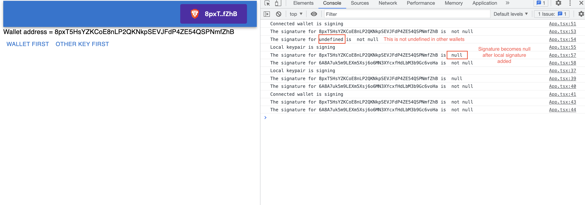
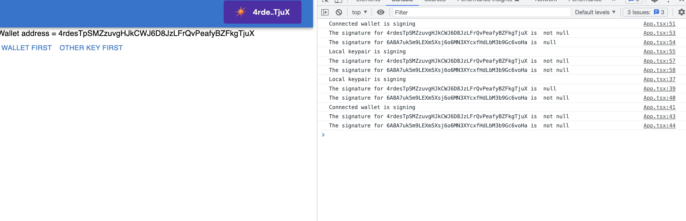

# Signing Order Bug
This repo reproduces a signing order bug by signing a transaction with one local wallet (DO NOT USE) and a wallet connected through the solana wallet adapter. The transaction consists of two System Program transfer instructions only to minimize dependencies. It is not supposed to sign the transaction but not send it to the network, so double-check this if you intend to try it. **Do not used the localWallet that I checked in for any real transactions.**

In Brave Wallet, the local wallet signature is undefined after signing. This leads `@solana/web3` dropping the Brave Wallet signature when it is signed by the local wallet. If the transaction is signed by the local wallet before being sent to Brave Wallet, both transactions are kept.

In Solflare both transactions are kept regardless of whether the local wallet signature is added before or after signing with Solflare.

